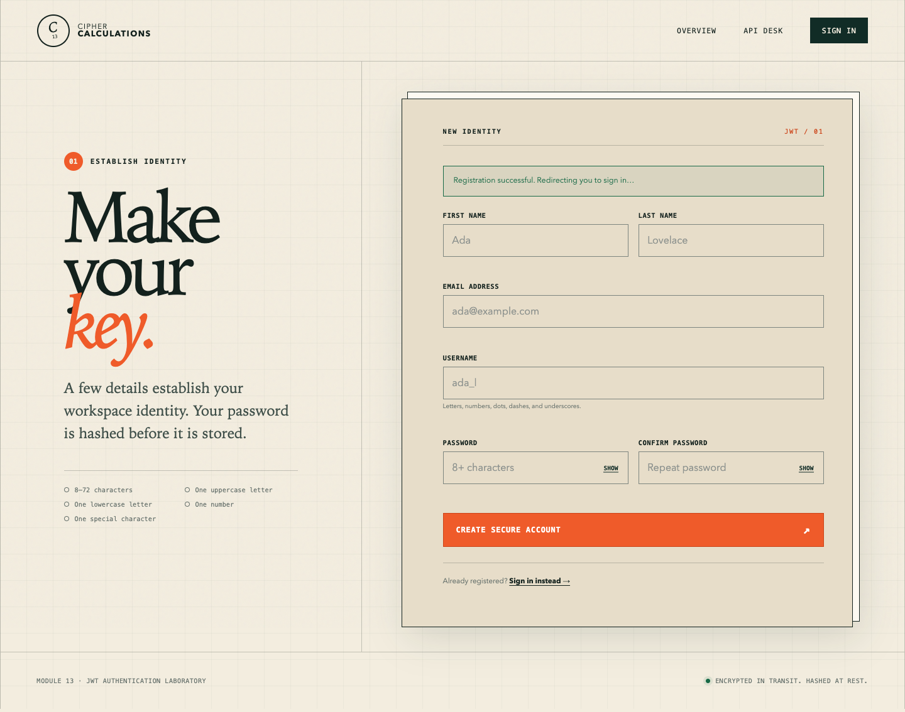
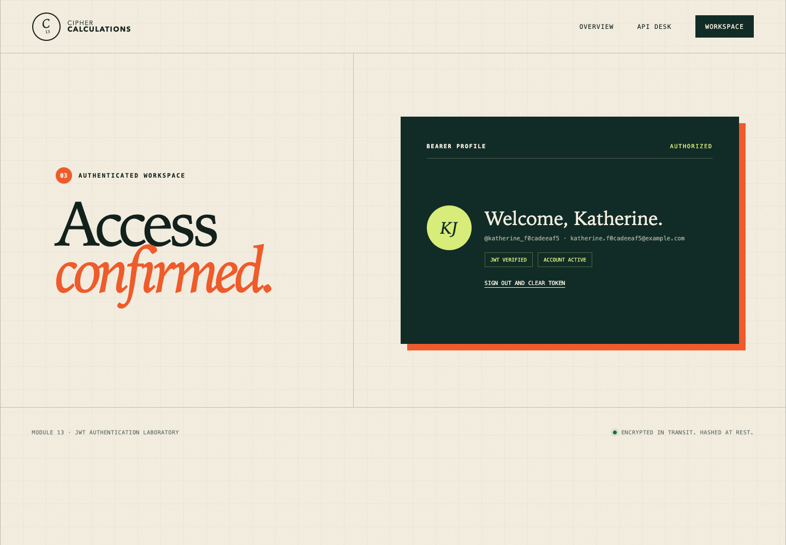
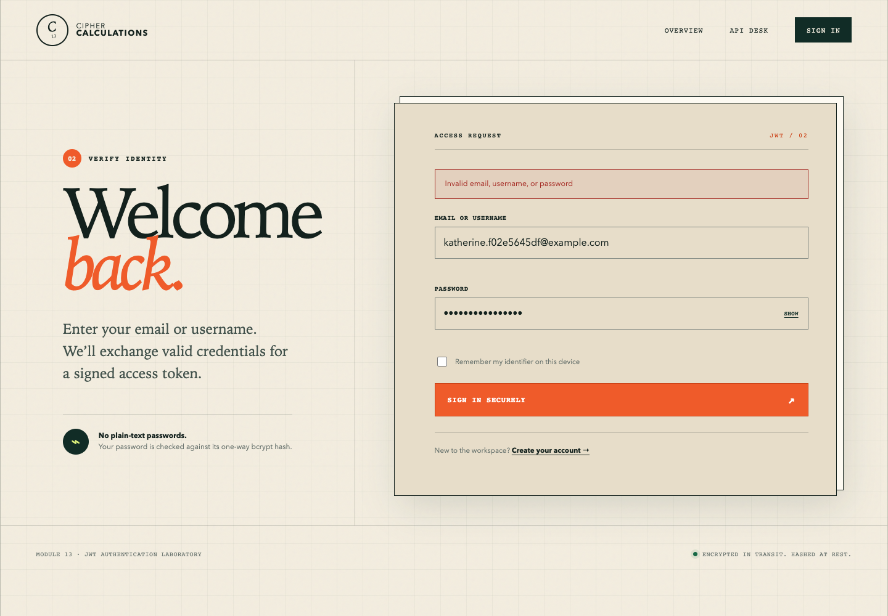

# Module 13 — JWT Authentication

[](https://github.com/MatthewFeroz/module13-jwt-auth/actions/workflows/ci.yml)

Cipher Calculations is a focused Module 13 full-stack authentication project.
FastAPI and PostgreSQL register users with bcrypt password hashes, issue signed
JSON Web Tokens for valid logins, and protect a profile endpoint with bearer
authentication. Jinja templates, CSS, and browser JavaScript provide the
registration, login, and authenticated-workspace experience. Calculation BREAD
is intentionally deferred to Module 14.

- GitHub: [MatthewFeroz/module13-jwt-auth](https://github.com/MatthewFeroz/module13-jwt-auth)
- Docker Hub: [matthewferoz/module13-jwt-auth](https://hub.docker.com/r/matthewferoz/module13-jwt-auth)
- Reflection: [REFLECTION.md](REFLECTION.md)

## Features

- `POST /register` validates names, email, username, password strength, and
  confirmation with Pydantic; rejects duplicate email addresses and usernames;
  and stores only a salted bcrypt hash.
- `POST /login` accepts either an email address or username, returns `401` for
  invalid credentials, and issues a short-lived HS256 JWT for valid credentials.
- `GET /auth/me` requires `Authorization: Bearer <token>` and returns the
  database user represented by the signed token.
- Jinja provides one shared layout with dedicated home, registration, login,
  and dashboard templates.
- JavaScript intercepts form events, performs client-side validation, sends JSON
  with `fetch`, displays accessible status messages, stores the token in
  `localStorage`, and includes it in the protected profile request.
- Nineteen automated tests cover schemas, bcrypt, JWT encoding/decoding, API
  behavior, and positive and negative Chromium journeys.
- GitHub Actions starts PostgreSQL, installs Chromium, runs every test, uploads
  test evidence, and publishes verified AMD64/ARM64 images to Docker Hub.

## Authentication Flow

```text
Registration form
    -> client validation
    -> POST /register
    -> Pydantic validation
    -> bcrypt hash
    -> PostgreSQL user

Login form
    -> POST /login
    -> bcrypt verification
    -> signed JWT
    -> localStorage
    -> GET /auth/me with Authorization: Bearer <JWT>
    -> authenticated dashboard
```

The dashboard redirect is a user-experience guard. The actual security boundary
is the server-side signature, expiry, token-type, active-user, and database
identity checks performed by `/auth/me`.

## Run with Docker Compose

Prerequisite: Docker Desktop with Docker Compose.

```bash
git clone https://github.com/MatthewFeroz/module13-jwt-auth.git
cd module13-jwt-auth
docker compose up --build
```

Open:

- Application: <http://localhost:8000>
- Registration: <http://localhost:8000/register>
- Login: <http://localhost:8000/login>
- Interactive API documentation: <http://localhost:8000/docs>
- Health check: <http://localhost:8000/health>

The Compose network connects the application to PostgreSQL without claiming a
host PostgreSQL port, so it can run alongside databases from earlier modules.
Stop the application with:

```bash
docker compose down
```

To also delete the local Module 13 database volume, use the following command.
This permanently removes accounts created in the Compose environment:

```bash
docker compose down --volumes
```

## Run Locally

Python 3.12 is recommended. Without `DATABASE_URL`, local development uses a
SQLite file; Docker and CI use PostgreSQL.

macOS/Linux:

```bash
python3.12 -m venv .venv
source .venv/bin/activate
python -m pip install --upgrade pip
pip install -r requirements.txt
playwright install chromium
uvicorn app.main:app --reload
```

Windows PowerShell:

```powershell
py -3.12 -m venv .venv
.\.venv\Scripts\Activate.ps1
python -m pip install --upgrade pip
pip install -r requirements.txt
playwright install chromium
uvicorn app.main:app --reload
```

For local PostgreSQL, copy `.env.example` to `.env` and update
`DATABASE_URL` and `JWT_SECRET_KEY`.

## Run the Tests

Install the browser once, then run the complete suite:

```bash
playwright install chromium
pytest
```

Useful focused commands:

```bash
pytest tests/unit -v
pytest tests/integration -v
pytest tests/e2e -v
pytest -m e2e -v
```

The E2E fixture starts the FastAPI server on an available local port. Tests
locate the actual form labels and buttons, type valid or invalid data, submit
the forms, inspect user-facing messages, verify the JWT in `localStorage`, and
load `/auth/me` through the authenticated dashboard.

## Build the Production Image

```bash
docker build --tag module13-jwt-auth:local .
docker run --rm --publish 8000:8000 \
  --env DATABASE_URL="sqlite+pysqlite:///./module13.db" \
  --env JWT_SECRET_KEY="replace-with-a-long-random-secret" \
  module13-jwt-auth:local
```

After a successful main-branch workflow:

```bash
docker pull matthewferoz/module13-jwt-auth:latest
```

The image runs as a non-root user and exposes a Docker health check against
`/health`.

## CI/CD

`.github/workflows/ci.yml` runs on every push and pull request to `main`.

1. A PostgreSQL 17 service starts with a dedicated test database.
2. Python dependencies and Playwright Chromium are installed.
3. Unit, API integration, and E2E tests run together with coverage.
4. JUnit, coverage XML, and browser screenshots are uploaded as the
   `module13-test-evidence` artifact even when a test fails.
5. Only after the test job passes, Docker Buildx builds the image.
6. Successful main-branch pushes publish `latest` and immutable commit-SHA tags
   to Docker Hub.

The GitHub repository must define these Actions secrets:

| Secret | Purpose |
| --- | --- |
| `DOCKERHUB_USERNAME` | Docker Hub account used by the login action |
| `DOCKERHUB_TOKEN` | Docker Hub access token; do not use an account password |

## Project Structure

```text
app/
├── auth.py              # Registration, authentication, bearer dependency
├── config.py            # Environment-backed settings
├── database.py          # SQLAlchemy engine and sessions
├── main.py              # Web pages and API routes
├── models.py            # User table
├── schemas.py           # Pydantic request/response validation
└── security.py          # bcrypt and JWT helpers
static/
├── css/style.css        # Responsive cipher-desk design system
└── js/app.js            # DOM events, fetch, localStorage, bearer requests
templates/               # Jinja layout and page templates
tests/
├── unit/                # Schema, hashing, and token tests
├── integration/         # Registration/login/profile API tests
└── e2e/                 # Playwright browser journeys
.github/workflows/ci.yml # Test -> Docker Hub pipeline
```

## Browser Evidence

Successful registration:



Authenticated bearer-token profile:



Rejected invalid credentials:



The same screenshots, JUnit report, and XML coverage report are downloadable
from each GitHub Actions run as the `module13-test-evidence` artifact.
