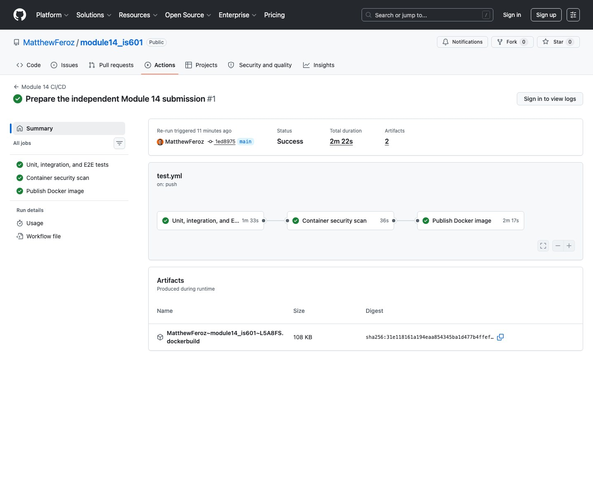
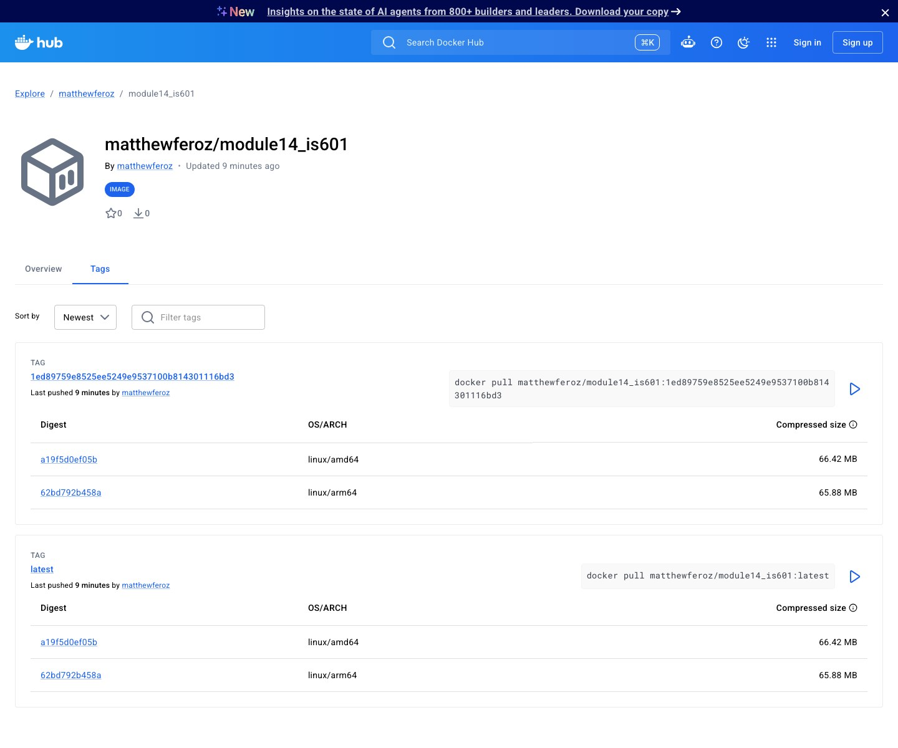
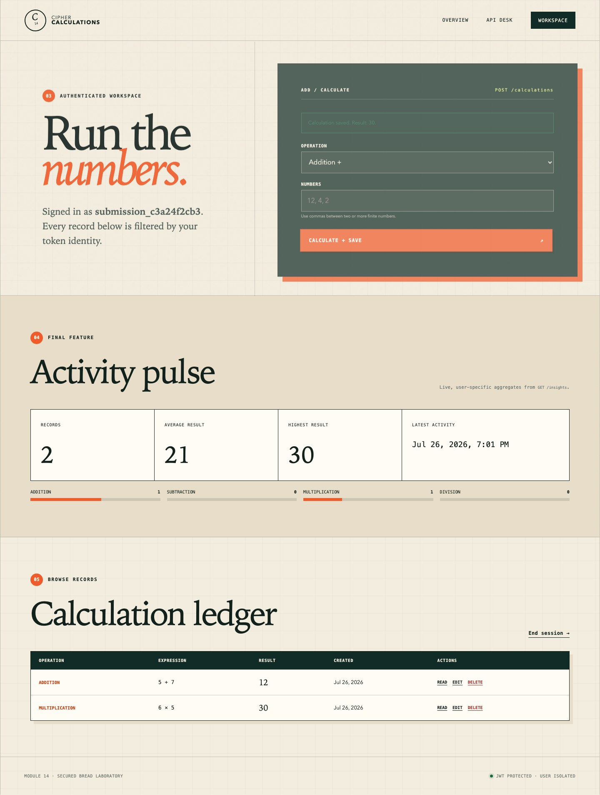
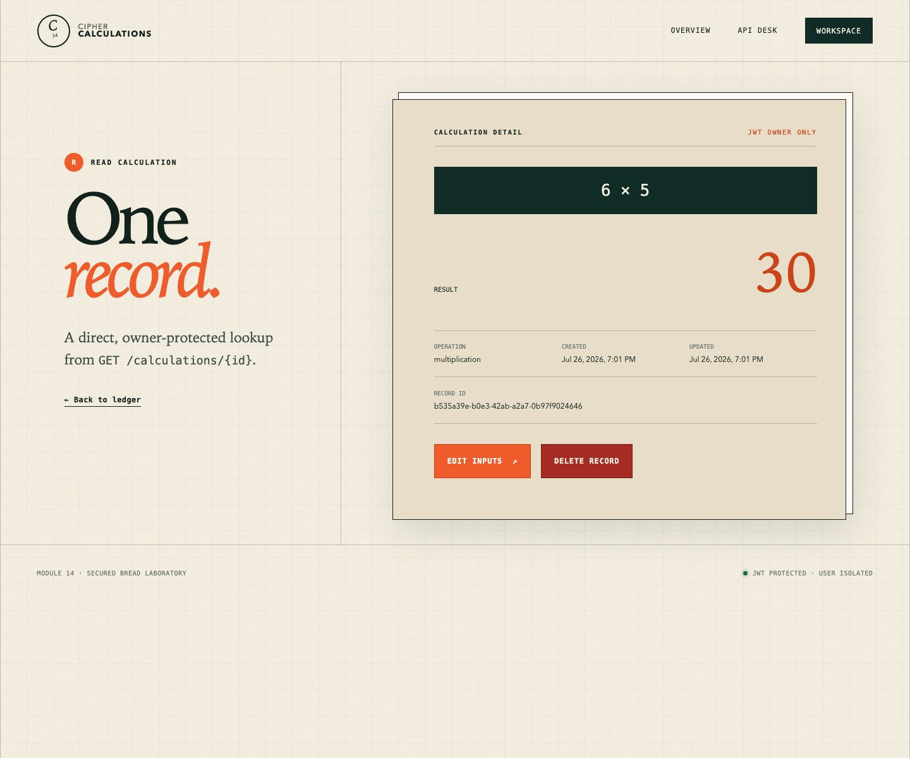
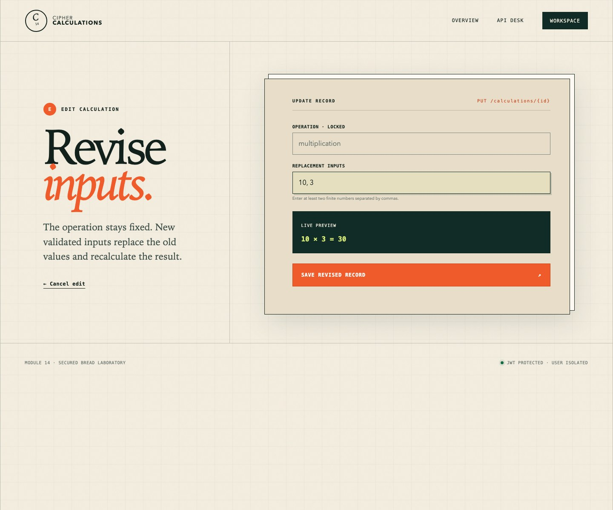
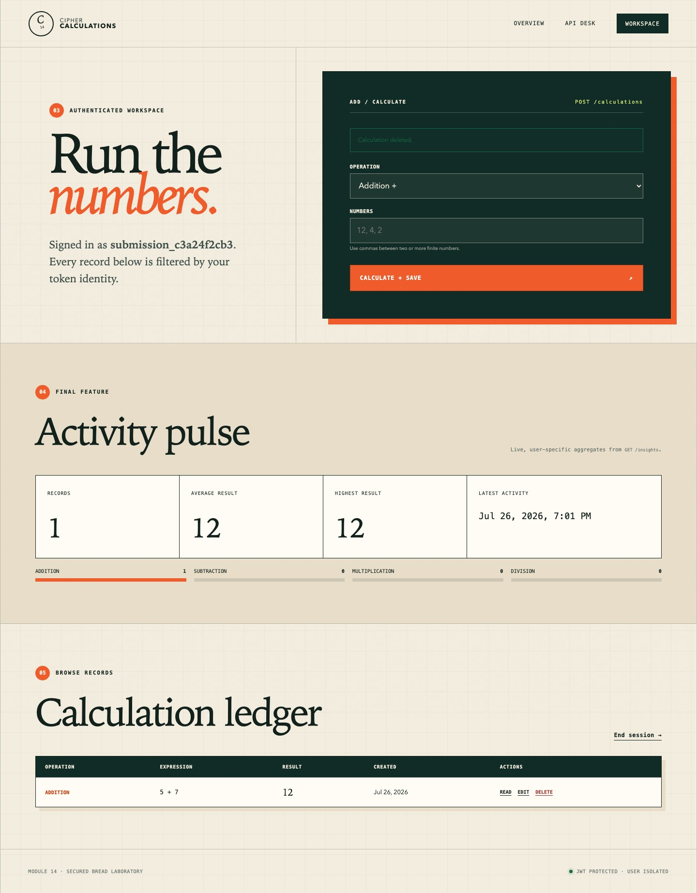

# Module 14: Secure Calculation BREAD

[](https://github.com/MatthewFeroz/module14_is601/actions/workflows/ci.yml)

Cipher Calculations is a FastAPI, PostgreSQL, and JavaScript application in
which authenticated users manage a private calculation history. It implements
complete BREAD functionality, client and server validation, JWT ownership
boundaries, automated testing, container security scanning, and multi-platform
Docker Hub publishing.

This repository directly continues the personal
[Module 13 JWT application](https://github.com/MatthewFeroz/module13-jwt-auth)
at commit `4115458`. The instructor's
[Module 14 repository](https://github.com/kaw393939/module14_is601) was
consulted as a read-only assignment reference; its Git history is not part of
this repository.

- Repository: <https://github.com/MatthewFeroz/module14_is601>
- Docker Hub: <https://hub.docker.com/r/matthewferoz/module14_is601>
- Reflection: [REFLECTION.md](REFLECTION.md)

## Assignment coverage

| BREAD action | Secured endpoint | Front-end behavior |
| --- | --- | --- |
| Browse | `GET /calculations` | Lists only the signed-in user's records |
| Read | `GET /calculations/{id}` | Opens an owner-protected detail page |
| Edit | `PUT /calculations/{id}` | Validates inputs and persists a new result |
| Add | `POST /calculations` | Calculates and saves a user-owned record |
| Delete | `DELETE /calculations/{id}` | Confirms and removes only the owned record |

Every calculation request requires `Authorization: Bearer <JWT>`. Record
queries include both the calculation ID and authenticated user ID, so another
user receives `404` instead of learning whether a record exists.

The final feature is a secured **Calculation Insights** panel backed by
`GET /insights`. It reports the user's record count, average result, highest
result, latest activity, and operation counts.

## Submission evidence

These screenshots come from the completed application and its successful
delivery pipeline. Select either delivery screenshot to open the corresponding
public page.

### Successful GitHub Actions workflow

[](https://github.com/MatthewFeroz/module14_is601/actions/runs/30215387918)

The captured workflow completed the test, container-security, and Docker
publishing jobs.

### Docker Hub deployment

[](https://hub.docker.com/r/matthewferoz/module14_is601/tags)

Docker Hub shows an immutable Git commit tag and `latest`, each containing
`linux/amd64` and `linux/arm64` images.

### Add and Browse



The Add form saved `5 + 7 = 12` and `6 × 5 = 30`. Browse displays both
user-owned records, while Insights reports two records, an average of 21, and
a highest result of 30.

### Read



The Read page retrieves one calculation by ID and identifies the view as
JWT-owner-only.

### Edit



The Edit form replaces the inputs with `10, 3`, validates them, and previews
the recalculated result before sending the `PUT` request.

### Delete



After confirmed deletion, the multiplication record is gone, the unrelated
addition record remains, and the private insights update from two records to
one.

## Quick start with Docker

Prerequisite: Docker Desktop with Docker Compose.

```bash
git clone https://github.com/MatthewFeroz/module14_is601.git
cd module14_is601
docker compose up --build
```

Open:

- Application: <http://localhost:8000>
- Interactive API documentation: <http://localhost:8000/docs>
- Health check: <http://localhost:8000/health>

Stop the stack without deleting database data:

```bash
docker compose down
```

Remove the development database volume as well:

```bash
docker compose down --volumes
```

## Local development

Python 3.12 and Bun are recommended. Local development defaults to SQLite;
Docker and CI use PostgreSQL.

```bash
python3.12 -m venv .venv
source .venv/bin/activate
python -m pip install --upgrade pip
python -m pip install -r requirements.txt
python -m playwright install chromium
uvicorn app.main:app --reload
```

Copy `.env.example` to `.env` when supplying PostgreSQL or custom JWT
configuration. Use a long, randomly generated JWT secret outside development,
and never commit `.env`.

## Tests

Run the complete Python suite, including real Chromium journeys:

```bash
pytest -q
```

Run the pure front-end validation tests with Bun:

```bash
bun test static/js/script.test.js
```

Useful focused commands:

```bash
pytest -q tests/unit
pytest -q tests/integration
pytest -q tests/e2e
```

The automated coverage includes:

- Arithmetic and Pydantic validation unit tests.
- JWT, bcrypt, registration, and login tests inherited from Module 13.
- Database integration tests for complete BREAD persistence and ownership.
- Positive and negative Playwright journeys for invalid tokens, malformed
  operands, division by zero, creation, reading, editing, and deletion.
- Unit and integration tests for the final Insights feature.

## Container image

Build the same application image used by CI:

```bash
docker build --tag matthewferoz/module14_is601:local .
```

After a successful push to `main`:

```bash
docker pull matthewferoz/module14_is601:latest
```

The image runs as a non-root user, exposes port `8000`, and includes an
application health check.

## CI/CD

`.github/workflows/ci.yml` gates delivery in this order:

1. Start PostgreSQL and run Bun, unit, integration, API, and Playwright tests.
2. Build the production image and scan fixed high/critical vulnerabilities.
3. On a successful `main` push, publish `latest` and the immutable commit SHA
   for `linux/amd64` and `linux/arm64`.

The GitHub repository requires these Actions secrets:

| Secret | Purpose |
| --- | --- |
| `DOCKERHUB_USERNAME` | Docker Hub account used by the login action |
| `DOCKERHUB_TOKEN` | Docker Hub access token; never use an account password |

## Project structure

```text
app/
├── auth.py              # Module 13 registration and bearer dependency
├── calculations.py      # Module 14 calculation model and arithmetic
├── config.py            # Environment-backed settings
├── database.py          # SQLAlchemy engine and sessions
├── insights.py          # User-specific aggregate feature
├── main.py              # Web pages and secured API routes
├── models.py            # Module 13 user model
├── schemas.py           # Auth and calculation Pydantic contracts
└── security.py          # bcrypt and JWT helpers
static/
├── css/style.css        # Responsive Module 13-derived visual system
└── js/
    ├── script.js        # JWT client and complete BREAD interactions
    └── script.test.js   # Bun client-validation unit tests
templates/               # Jinja authentication and calculation pages
tests/
├── unit/                # Isolated security, schema, arithmetic, insights
├── integration/         # API, database, JWT, and ownership boundaries
└── e2e/                 # Real Chromium authentication and BREAD journeys
```

Alembic was not required because this final submission initializes a fresh
Module 14 schema and the Insights feature derives values from existing
calculation records.
